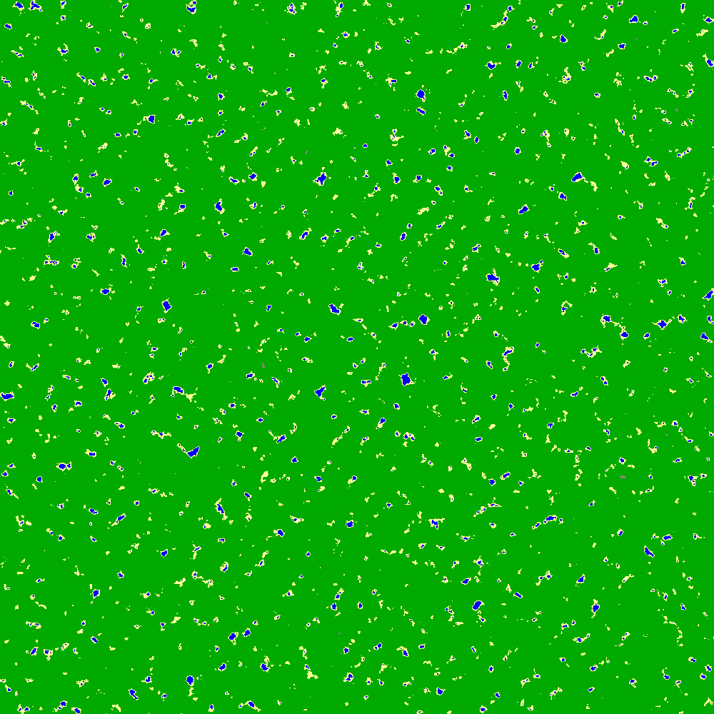
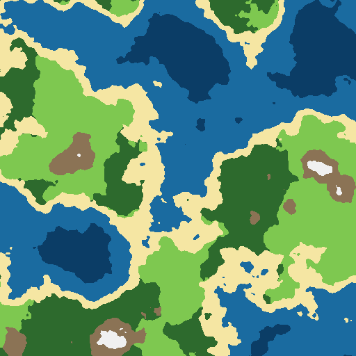
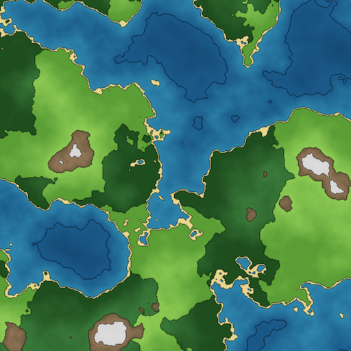
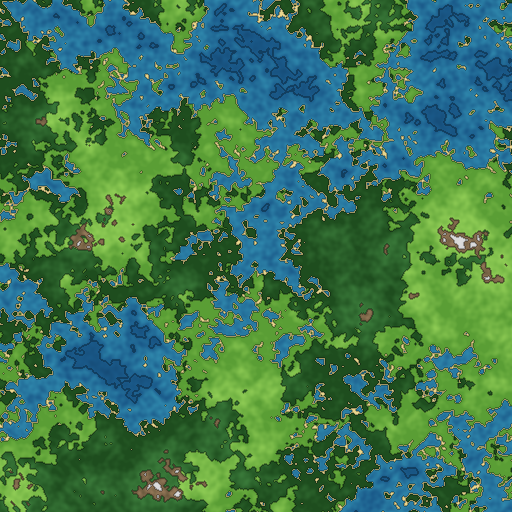
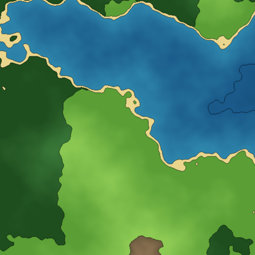

# Procgen-world - Procedural World Generator

> Generate, persist and share procedural worlds

## Stack

- Backend : Java 21 - Spring Boot 4.x - PostgreSQL
- Frontend : Angular 20
- Infra : Docker compose - Github Actions

## Why this project?

I've always been fascinated by procedural generation, the idea that a single number (a seed) can deterministically produce an entire world, with its own geography, biomes and history.

Procgen-world is my starting exploration of that space. 
Rather than switching to a more "game-oriented" stack, I deliberately kept my usual tools (Java/Angular) to focus on the algorithmic challenges rather than learning a new ecosystem.
This is an intentional tradeoff, not an oversight.

Through this project I'm exploring:
- Coherent noise algorithms (Perlin Noise, octaves)
- Procedural content generation (biomes, cities)
- Generative text via Markov chains
- Structural generation via Wave Function Collapse
- Full-stack architecture across few incremental phases

## Roadmap
- [x] Phase 1 - Pure Java generation engine (Perlin Noise, biomes, PNG export)
- [ ] Phase 2 - Spring Boot REST API + PostgreSQL
- [ ] Phase 3 - Angular frontend + Canvas 2D
- [ ] Phase 4 - Enrichment (Markov chains, WFC)

## Phase 1

- **Noise generation** - multi-octave Perlin Noise with configurable scale, octaves and persistence
- **Biome resolution** - seven biomes resolved from height and humidity maps
 (`DEEP_WATER`,`OCEAN`,`BEACH`,`PLAINS`,`FOREST`,`MOUNTAIN`,`SNOW_PEAKS`)
- **PNG export** - color interpolation per biome, biome border rendering, humidity debug export

### Visual progression - seed 42

<table>
<tr>
    <td align="center">
        
    </td>
    <td align="center">
        
    </td>
    <td align="center">
        
    </td>
</tr>
<tr>
    <td>
        <b>Initial output</b>
         
        <i>Poor noise distribution</i>
    </td>
    <td>
        <b>Intermediate output</b>
         
        <i>Biomes resolver improved</i>
    </td>
    <td>
        <b>Actual output</b>
         
        <i>Color interpolation + Biome borders </i> 
    </td>        
</tr>
</table>

### Visual examples of various configurations

<table>
<tr>
    <td align="center">
        
    </td>
    <td align="center">
        
    </td>
    <td align="center">
        
    </td>
</tr>
<tr>
    <td>
        <b>Low octaves</b>
         
        <i>Less detail, larger structures</i>
    </td>
    <td>
        <b>high persistence</b>
         
        <i>Fine details become are amplified</i>
    </td>
    <td>
        <b>high scale</b>
         
        <i>Zooms in, more detail on a smaller area</i>
    </td>        
</tr>
</table>

> Documentation will be added as the project grows.